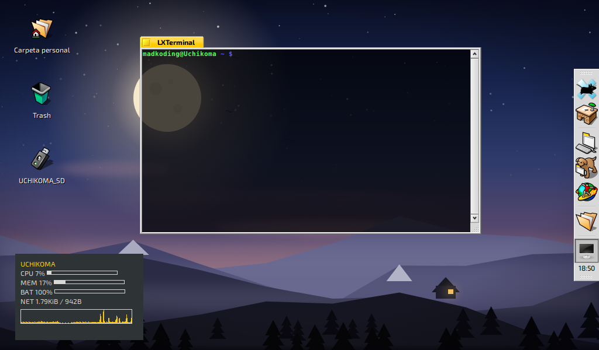
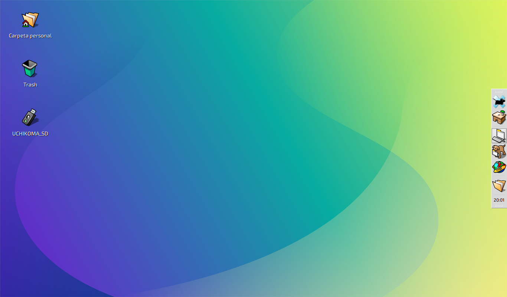

# Haiku XFCE Theme Pack

Tema completo Haiku/cyberpunk para XFCE 4.x, xfwm4, GTK2/GTK3, notificaciones, panel e iconos.

## Incluye

- **Haiku** — tema GTK2/GTK3/GTK4 base (B00merang Project), con correcciones para XFCE.
- **Haiku-ish-Smooth** — tema de ventanas xfwm4 con bordes suaves y colores Haiku.
- **HaikuDecorator** — tema GTK2 para decoradores Metacity/Unity con tipografía Exo 2.
- **xfce-notify-4.0** — notificaciones limpias sin gradientes grises.
- **xfce4-panel** — estilo de panel Haiku sin bandas.
- **Iconos de escritorio** — etiquetas blancas con sombra negra, fondo transparente.

## Screenshots

| Escritorio limpio | Decoraciones de ventana | Sin conky |
|---|---|---|
|  |  |  |

## Instalación

```bash
./install.sh
```

O manualmente:

```bash
cp -r Haiku-XFCE/themes/* ~/.themes/
cp -r Haiku-XFCE/icons/* ~/.icons/ 2>/dev/null || true
cp -r Haiku-XFCE/wallpapers/* ~/.config/wallpapers/ 2>/dev/null || true
```

## Configuración recomendada

- WM theme: `Haiku-ish-Smooth`
- GTK theme: `Haiku`
- Icon theme: `Haiku`
- Cursor: `DMZ-White` size 10
- Font: `Exo 2` / `Noto Sans`
- Wallpaper: incluido en `wallpapers/`

## Scripts

- `scripts/apply-resolution.sh` — resolución virtual 1366x800 sobre panel 1024x600.
- `scripts/apply-wallpaper.sh` — aplica el fondo Haiku por defecto.

## Autor

Packaging para Uchikoma (Acer Aspire One, XFCE 4.8) por madkoding.
Tema base Haiku por B00merang Project.
